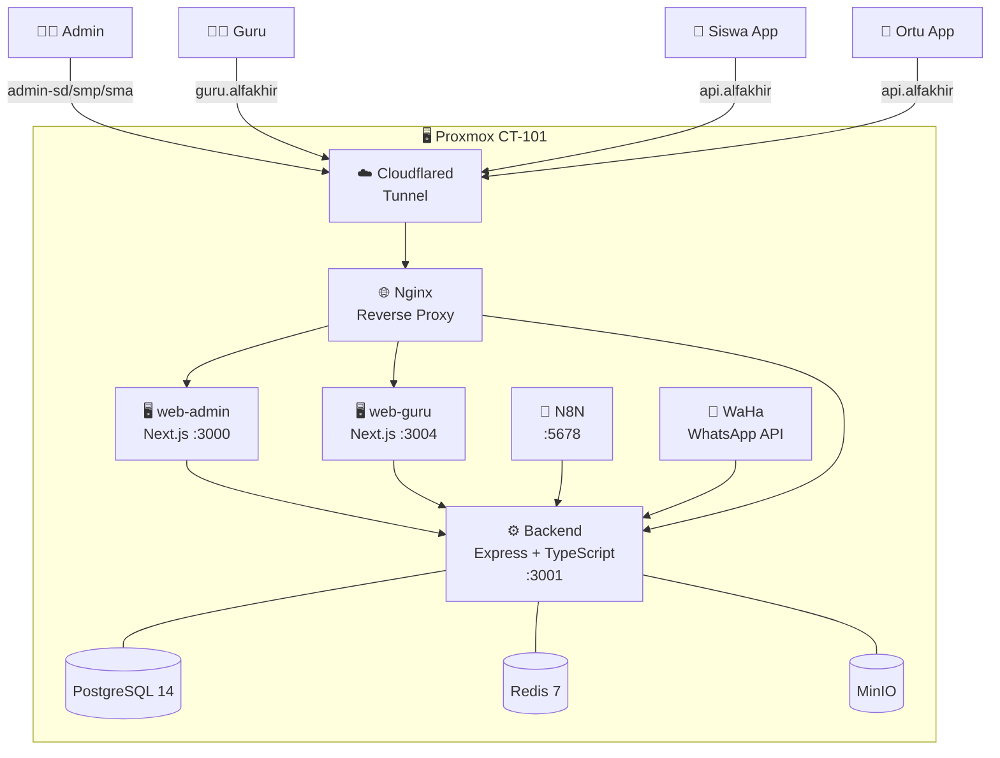

<div align="center">


<br/>


<br/>

[](https://www.typescriptlang.org/)
[](https://nextjs.org/)
[](https://flutter.dev/)
[](https://www.postgresql.org/)
[](https://redis.io/)
[](https://nginx.org/)

</div>

---

<div align="center">

### 🏫 Satu platform untuk seluruh ekosistem sekolah Islam Al Fakhir

*Absensi · Nilai · Jurnal Guru · Pembayaran · Notifikasi WhatsApp · Laporan · Mobile App*

</div>

---

## ✨ Fitur Utama

<table>
<tr>
<td width="50%">

**🚪 Absensi Cerdas**
- Scan RFID / QR gerbang → otomatis hadir di semua jadwal
- Guru input hadir → sinkron ke absensi gerbang
- Izin bisa ke satu atau semua mata pelajaran

**📊 Akademik Lengkap**
- Input nilai, kuis, tugas, UTS, UAS
- Generate rapor per semester
- Rekap absensi bulanan (Excel)

**💳 Manajemen Pembayaran**
- SPP, tagihan, riwayat pembayaran
- Otomasi notifikasi via N8N

</td>
<td width="50%">

**💬 Notifikasi Real-Time**
- WhatsApp ke orang tua saat siswa masuk/pulang
- Notifikasi in-app untuk guru & admin

**👥 Multi-Peran**
- Admin SD / SMP / SMA terpisah
- Portal khusus guru
- App mobile siswa & orang tua

**🔒 Keamanan**
- JWT + refresh token
- RBAC (admin / guru / siswa / ortu)
- Audit log setiap aktivitas

</td>
</tr>
</table>

---

## 🏗️ Arsitektur Sistem



---

## 🔄 Alur Absensi Otomatis

```
┌─────────────────────────────────────────────────────────┐
│  Siswa scan RFID / QR di gerbang                       │
│         ↓                                               │
│  absensi_gerbang → waktu_masuk tercatat                 │
│         ↓  (otomatis, tidak overwrite izin manual)      │
│  Semua jadwal pelajaran hari ini → status HADIR ✅      │
│         ↓  (berlaku sebaliknya)                         │
│  Guru input HADIR di kelas                              │
│         ↓                                               │
│  absensi_gerbang → waktu_masuk terisi jika kosong       │
│         ↓                                               │
│  WhatsApp → Orang Tua 📲                                │
└─────────────────────────────────────────────────────────┘

Izin → bisa ke 1 jadwal saja ATAU semua jadwal hari itu
```

---

## 🛠️ Tech Stack

| Layer | Teknologi |
|---|---|
| **Backend** | Node.js · TypeScript · Express.js · Sequelize ORM |
| **Database** | PostgreSQL 14 · Redis 7 |
| **Frontend** | Next.js 16 · React · Tailwind CSS |
| **Mobile** | Flutter (Android & iOS) |
| **Infrastruktur** | Docker Compose · Proxmox LXC · Nginx · Cloudflared |
| **Automasi** | N8N · WaHa (WhatsApp HTTP API) |
| **Storage** | MinIO (S3-compatible, self-hosted) |
| **CI/CD** | GitHub Actions → self-hosted runner di CT101 |

---

## 📂 Struktur Proyek

```
alfakhir/
├── backend/              # Express.js + TypeScript API (port 3001)
│   └── src/
│       ├── controllers/  # Business logic
│       ├── models/       # Sequelize ORM
│       ├── routes/       # API routing
│       ├── middleware/   # Auth, audit, error handler
│       └── utils/        # absensiSync, WA notif, dll
├── web-admin/            # Next.js dashboard admin (port 3000)
├── web-guru/             # Next.js portal guru (port 3004)
├── siswa_app/            # Flutter app siswa
├── orang_tua_app/        # Flutter app orang tua
├── nginx/                # Reverse proxy config
├── n8n/                  # Workflow automasi pembayaran
├── monitoring/           # Health check stack
├── scripts/              # Backup, deploy, maintenance
├── docs/                 # Dokumentasi lengkap (10 file)
├── tests/                # API test suite (55+ endpoint)
├── .github/workflows/    # CI/CD pipelines
└── docker-compose.prod.yml
```

---

## 🌐 Domain Produksi

| Layanan | URL |
|---|---|
| 🏫 Admin SD | `admin-sd.smpialfakhir.sch.id` |
| 🏫 Admin SMP | `admin-smp.smpialfakhir.sch.id` |
| 🏫 Admin SMA | `admin-sma.smpialfakhir.sch.id` |
| 👨‍🏫 Portal Guru | `guru.smpialfakhir.sch.id` |
| ⚙️ API | `api.smpialfakhir.sch.id` |

---

## 📊 Project Stats

<div align="center">

| Metrik | Jumlah |
|---|---|
| 📝 Lines of Code | 15,000+ |
| 🔌 API Endpoints | 67+ |
| 🗃️ Database Tables | 16 |
| 🖥️ Halaman Web | 24 (admin: 14, guru: 10) |
| 📱 Mobile Screens | 14 tab + auth |
| 📚 Dokumentasi | 10 file |
| 🧪 Test Cases | 55+ API tests |

</div>

---

## 🚀 Deploy (Proxmox)

```bash
# 1. Jalankan installer di Proxmox sebagai root
curl -fsSL https://raw.githubusercontent.com/AlfakhirSchool/ALFAKHIR_SCHOOL/main/proxmox-install.sh | bash

# 2. Clone & konfigurasi
git clone https://github.com/AlfakhirSchool/ALFAKHIR_SCHOOL.git ~/alfakhir
cd ~/alfakhir && cp .env.production .env
# Edit .env — set POSTGRES_PASSWORD, JWT_SECRET, WA_API_KEY, dll

# 3. Start semua service
docker compose -f docker-compose.prod.yml up -d

# 4. Health check
bash scripts/health-check.sh
```

---

## 📚 Dokumentasi

| File | Isi |
|---|---|
| [`INSTALLATION_RUNBOOK.md`](docs/INSTALLATION_RUNBOOK.md) | Panduan install lengkap |
| [`DEPLOYMENT_GUIDE.md`](docs/DEPLOYMENT_GUIDE.md) | Prosedur deployment |
| [`API_DOCUMENTATION.md`](docs/API_DOCUMENTATION.md) | Referensi API lengkap |
| [`TROUBLESHOOTING_GUIDE.md`](docs/TROUBLESHOOTING_GUIDE.md) | Solusi masalah umum |
| [`OPERATIONS_MANUAL.md`](docs/OPERATIONS_MANUAL.md) | Operasional harian |
| [`DISASTER_RECOVERY_PLAN.md`](docs/DISASTER_RECOVERY_PLAN.md) | Prosedur pemulihan |

---

<div align="center">

**© 2026 Al Fakhir Islamic School**

*Dikembangkan untuk mempermudah manajemen akademik SD, SMP, dan SMA Islam Modern Al Fakhir*

*Membentuk generasi berakhlak dan berprestasi* 🌟

<br/>


</div>
